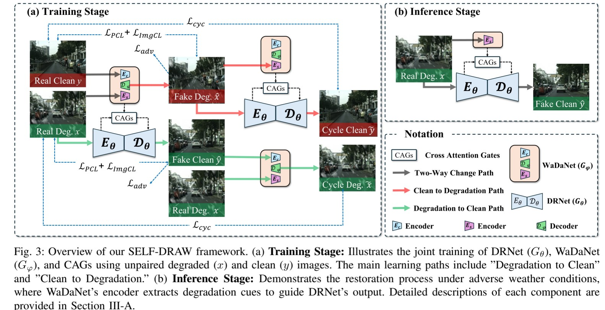

#  SELF-DRAW:Self-Degradation Aware Unpaired Restoration via Unified Architecture for Adverse Weather Removal

# Abstract
Unpaired training methods have gained increasing attention in adverse weather restoration, as they eliminate the need for paired clean and degraded images. However, most existing approaches rely on weather-specific attention mechanisms, such as transmission maps or rain masks, limiting their generalization across diverse degradation types. To address this issue, we propose SELF-DRAW, a **Self**-**D**egradation Aware Unpaired **R**estoration framework with a unified **A**rchitecture for Adverse **W**eather removal. The framework comprises three key components: a Degradation Restoration Network (DRNet) for restoring clean images, a Weather-Agnostic Degradation-Aware Network (WaDaNet) for pixel-level degradation estimation independent of weather conditions, and Cross Attention Gates (CAGs) for adaptive fusion of multi-scale features. Experiments on six diverse weather-degraded datasets demonstrate that SELF-DRAW consistently outperforms state-of-the-art methods in restoration quality. Furthermore, it improves object detection performance on degraded images by an average of 18\% in mean Average Precision (mAP), demonstrating strong generalization and applicability to downstream vision tasks.



# Using the code:
Clone this repository:
```bib
git clone https://github.com/vitowen9580/SELF-DRAW.git
cd SELF-DRAW
